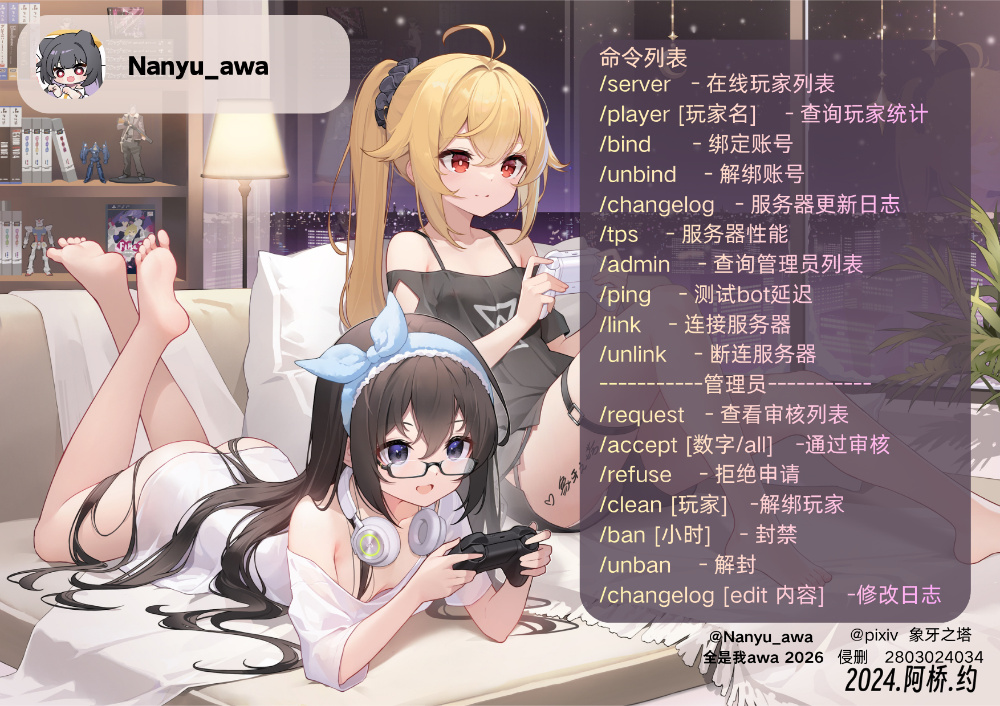

# QQbot_awa

服务端侧的 **QQ 机器人接口模组**。

模组本身不连接 QQ，而是在服务端进程内起一个本地 HTTP 服务（默认 `127.0.0.1:25566`），配套的 Python QQ 机器人通过它来：

- 查询服务器实时状态（TPS、在线玩家等）
- 完成 QQ 与游戏账号的绑定 / 解绑
- 播报玩家进出、聊天等消息
- 管理管理员名单、封禁名单

通信内容使用 PBKDF2 派生密钥 + AES-GCM 加密。



## 环境

| 依赖 | 版本 |
| --- | --- |
| Minecraft | 26.3 |
| Fabric Loader | 0.18.4+ |
| Fabric API | 0.152.1+ |
| Java | 25 |

只需要装在**服务端**。

## 使用

1. 把 `build/libs/qqbot_awa-2.5.jar` 放进服务端 `mods/` 目录
2. 启动服务器，会生成以下配置文件：

| 文件 | 说明 |
| --- | --- |
| `config/awabot.properties` | 通信密码、监听端口、绑定地址、安全选项 |
| `config/awabot_config.json` | 账号绑定关系、管理员与封禁名单 |
| `config/awabot_messages.properties` | 各类播报文案 |

3. **务必先改掉默认密码**（默认 `123456`，模组会检测弱密码并告警），并确认监听端口只对本机或可信网络开放

## 游戏内命令

| 命令 | 说明 |
| --- | --- |
| `/qqbot help` | 查看帮助 |
| `/qqbot bind bot` / `/qqbot bind server` | 绑定 QQ（机器人侧 / 服务端侧发起） |
| `/qqbot unbind` | 解除绑定 |
| `/qqbot admin` / `/qqbot unadmin` | 添加 / 移除管理员 |
| `/qqbot clean` | 清理失效的绑定缓存 |
| `/qqbot reload` | 重新读取配置 |

## 构建

需要 JDK 25：

```bash
gradlew build
```

产物在 `build/libs/`。
